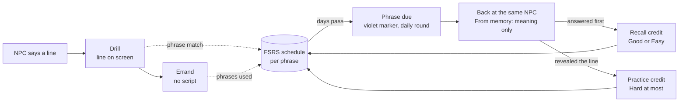
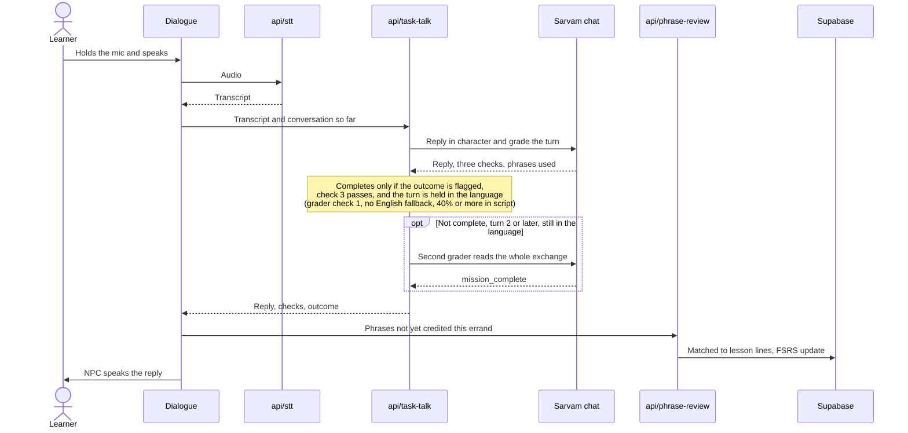
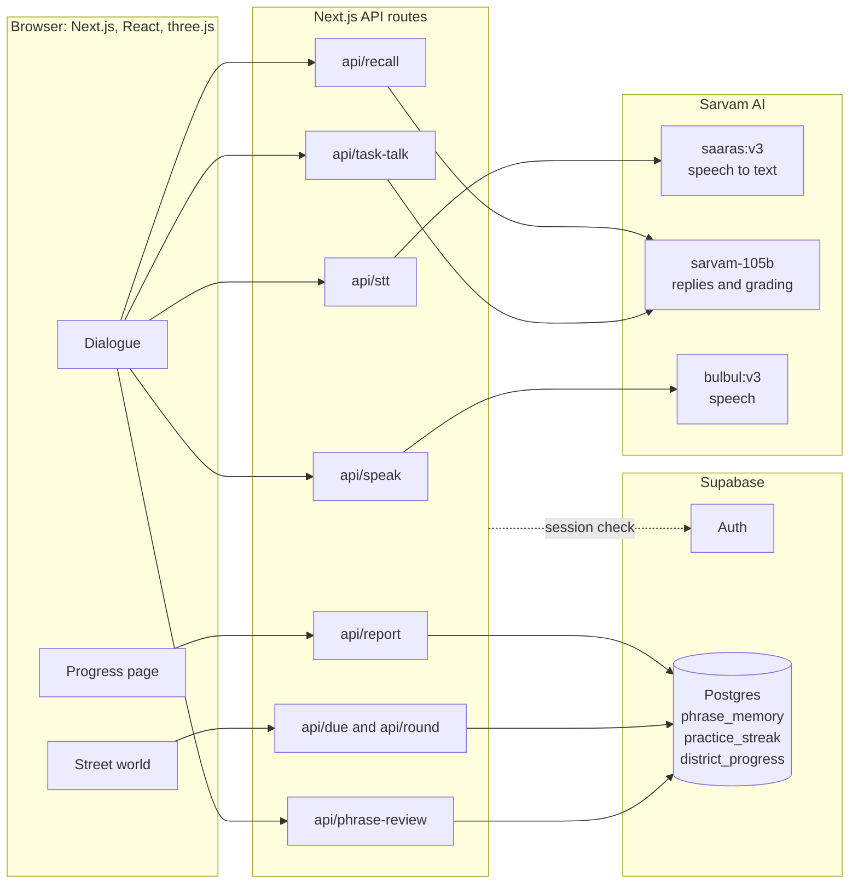

<p align="center">
  
</p>

# SADAK

**Learn the language by getting something done. Then come back and see what you remember.**

SADAK is a speaking game for people moving to an Indian city who know a few words but struggle with everyday conversations. Walk up to an auto driver, shopkeeper or bus conductor, practise the lines you need, and use them to finish an unscripted errand.

When a phrase is due for review, the game sends you back to the person who taught it. This time, you try saying it before the answer appears.

**[Play SADAK](https://sadak-virid.vercel.app) · [Run locally](#run-locally) · [How learning works](#how-learning-works) · [Check the project](#check-the-project)**

<p align="center">
  <a href="docs/media/sadak-preview.mp4">
    
  </a>
</p>
<p align="center"><sub>
  50-second preview, <a href="docs/media/sadak-preview.mp4">also as MP4</a>. Recorded by driving the game automatically. The voice is a Sarvam Bulbul recording of the drill line, transcribed and scored live by the game; both scores shown are real. The week between the two visits is simulated with a development tool.
</sub></p>

Built for the **Nerdy AI Hackathon Challenge, Prompt 02: Language Learning**.

## What makes SADAK different

- **Conversations have a purpose.** Agree on a fare, place an order or get a ticket. The character responds to what you say, and the game checks whether the errand's outcome happened.
- **Reading and remembering count differently.** A sentence read from the screen earns practice credit. A due phrase spoken before revealing the answer earns recall credit.
- **The street becomes your review route.** Spaced repetition brings due phrases back through their NPCs, with map markers and a daily round of up to four stops.
- **You can see what happened.** The completion card reports due phrases recalled, hints shown, English fallback detected and practised lines used in conversation.
- **Ten cities, ten languages.** Each district has its own streets, characters, lessons and visual identity. Learn the language in the kind of place where you would use it.

## Why build this?

Knowing a phrase and using it with another person are different experiences. A driver names a price you did not expect. A shopkeeper asks a follow-up question. You have to listen, decide what you mean and say it out loud.

SADAK gives learners somewhere to practise those exchanges. It provides support at first, removes the script for the errand, and checks due phrases on a return visit. The goal is practical: ask for what you need and understand enough to keep the conversation going.

## Try a first errand

Open the [game](https://sadak-virid.vercel.app), sign in, and allow microphone access when asked. Headphones help keep the character's voice out of your recording.

1. Choose a city, your instruction language and your comfort level.
2. Walk to a task character. Follow the short speaking drill with romanisation and meanings on screen.
3. Hold the microphone button to speak, then release it to send your answer.
4. Finish the errand without the displayed script. Listen to the reply and respond to the actual price, destination or order.
5. Read the completion card, then visit `/progress` to see your phrase review states.
6. On a return visit with due phrases, try the **From memory** questions before seeing the lines again. **Show me the line** is available if you need help.

Phone play uses landscape orientation and touch controls. On desktop, use WASD to move, E to interact, P for the phrasebook and Esc to leave a conversation or pause.

## How learning works



A new phrase is taught with the line visible, then used in an unscripted errand. Both feed a per-phrase schedule. When the schedule says the phrase is fading, the learner is sent back to the character who taught it and asked for it before the answer is shown.

### Practice, use and recall

The guided drill compares the speech transcript with the expected phrase and highlights matching words. The errand then asks the learner to use the language in a conversation with a concrete outcome.

Returning learners get up to two due phrases before the lesson begins. The meaning is shown first; the target sentence stays hidden until they answer or ask to reveal it. The review records whether the answer was visible.

Each attempt updates a per-phrase [FSRS schedule](game_engine/lib/game/phrase-memory.ts):

| Evidence | Scheduler grade |
| --- | --- |
| Answer visible, phrase match of 40% or more | Hard |
| Answer hidden, phrase match of 90% or more | Easy |
| Answer hidden, phrase match of 72% to below 90% | Good |
| Answer hidden, phrase match of 40% to below 72% | Hard |
| Phrase match below 40%, once recorded | Again |
| Target phrase used in an errand without English fallback | Good |
| Target phrase used in an errand with English fallback | Hard |

Fresh use in an errand does not earn Easy: the learner just saw the phrase in the drill. A suspected recognition error gets a retry before it affects the schedule.

**Phrase match measures recognized words, not pronunciation.** Review dates and retention states are scheduler estimates, not proof of fluency.

### An errand must actually finish

The conversation route checks the model's outcome verdict against its language and outcome checks. Target-script coverage provides another signal about the closing turn. When an eligible exchange remains incomplete, a second grader can check the conversation including the NPC's latest reply.



Reported phrases are matched to the district's lesson content. Punctuation variants are normalized, unknown phrases are dropped, and repeated phrases are filtered before recording. See the [conversation route](game_engine/app/api/task-talk/route.ts), [phrase matching](game_engine/lib/game/due.ts) and [review endpoint](game_engine/app/api/phrase-review/route.ts).

### A reason to return

Due phrases map back to their teachers on the street. The daily round groups these into up to four stops, prioritizing stops with more due phrases. Difficulty can move one tier up or down based on review history once there is enough evidence.

The progress page shows phrases, meanings, review states and who taught them. Streaks use the learner's local day; the server requires recorded practice before accepting a round-clear request.

## The cities

| City | Language | City | Language |
| --- | --- | --- | --- |
| Old Delhi | Hindi | Hyderabad | Telugu |
| Chennai | Tamil | Kochi | Malayalam |
| Bengaluru | Kannada | Mumbai | Marathi |
| Kolkata | Bengali | Ahmedabad | Gujarati |
| Amritsar | Punjabi | Bhubaneswar | Odia |

The three.js world includes streets, stalls, moving traffic and local landmarks. Districts change the buildings, lighting, weather and street details. The setting gives each conversation a place and a person to return to.

## Run locally

### Requirements

- Node.js 22.x and npm.
- A Supabase project for authentication, district content and learner progress.
- A Sarvam API key for speech recognition, conversation and speech playback.
- A microphone and a browser with WebGL support.

Python and LiveKit are not required for the current push-to-talk lesson flow.

### 1. Install

```bash
git clone https://github.com/RajdeepKushwaha5/sadak.git
cd sadak/game_engine
npm ci
```

Copy `.env.example` to `.env` in `game_engine/`:

```bash
# macOS or Linux
cp .env.example .env
```

```powershell
# Windows PowerShell
Copy-Item .env.example .env
```

### 2. Configure services

Set these values in `.env`:

| Variable | Purpose |
| --- | --- |
| `SARVAM_API_KEY` | Speech and conversation requests |
| `NEXT_PUBLIC_SUPABASE_URL` | Your Supabase project URL |
| `NEXT_PUBLIC_SUPABASE_PUBLISHABLE_KEY` | Supabase browser publishable key |
| `SUPABASE_DB_URL` | Database connection URI for the migration script; add this entry locally |
| `NEXT_PUBLIC_POSTHOG_PROJECT_TOKEN` | Your PostHog project token, if collecting analytics |
| `NEXT_PUBLIC_POSTHOG_HOST` | PostHog host; the example uses the EU endpoint |

Replace or remove unused placeholder values in the example file. Keep credentials out of version control. `SUPABASE_DB_URL` is for local database setup, not browser code.

In Supabase Authentication, enable Google sign-in or email magic links. Add `http://localhost:3000` as the local site URL and `http://localhost:3000/auth/callback` to the allowed redirect URLs. Google sign-in also requires its provider credentials in Supabase.

For local testing, the development login page also has an email and password form. Enable that provider and create a test user in your Supabase project if you want to use it.

### 3. Create and seed the database

From `game_engine/`, with `SUPABASE_DB_URL` set:

```bash
npx tsx scripts/run-migrations.ts
```

Alternatively, apply the SQL files in [supabase/migrations](game_engine/supabase/migrations) in filename order through Supabase's SQL editor. These create the districts, progress tables, phrase memory, streaks and supporting policies.

### 4. Start the game

```bash
npm run dev
```

Open **http://localhost:3000** and sign in. The lesson flow uses the Next.js speech and conversation endpoints.

For a production build, stop the development server first:

```bash
npm run build
npm start
```

Both modes use `.next`, so avoid building while the development server is running. A deployed site needs HTTPS for browser microphone access.

## Check the project

From `game_engine/`:

```bash
npx tsc --noEmit --incremental false
npx tsx scripts/validate-street-lessons.ts
npm run build
```

The lesson validator checks tier lengths and the ordering of price questions and replies. It does not evaluate translation quality or conversation grading. There is not yet a checked-in automated end-to-end suite for the learning flow.

For a manual check, complete an errand, confirm that phrases appear in `/progress`, then revisit a due phrase and try both answering from memory and revealing the line. Check that the completion card distinguishes the two.

### Demonstrating a return visit

In development, `/progress` includes a **simulated time** control. It moves the signed-in account's review timestamps backwards so due phrases and daily rounds can be exercised in one sitting. It can also seed a simulated streak.

Use a dedicated test account: this changes stored records. The control is unavailable in production. Simulated elapsed time demonstrates scheduling behavior; it is not a measured retention result.

### Current limits

- Conversation grading can still make mistakes. The checks reduce inconsistent results but do not replace evaluation against reviewed examples.
- Speech recognition can mishear an answer. Phrase matching does not assess accent or pronunciation directly.
- The project does not yet include a published benchmark across all ten languages or a longitudinal learning study.
- Mobile play currently requires landscape orientation.
- The second grading call adds latency on eligible incomplete turns.

## Under the hood



| Part | Implementation |
| --- | --- |
| Web app and routes | Next.js 15, React 19, TypeScript |
| Street world | three.js |
| Speech recognition | Sarvam `saaras:v3` |
| Character replies and grading | Sarvam `sarvam-105b` |
| Speech playback | Sarvam `bulbul:v3` |
| Authentication and persistence | Supabase Auth and Postgres |
| Review scheduling | `ts-fsrs` |
| Interface | Tailwind CSS and shadcn components |
| Product analytics | PostHog |

When configured, PostHog records events including `language_attempt_scored`, `delayed_recall_attempted`, `attempt_retry_offered`, `errand_turn_graded` and `errand_completed`. These expose phrase-match scores, whether an answer was revealed, grading results and completion behavior in your PostHog project. They describe usage and attempts, not proven learning gains.

### Repository map

```text
game_engine/
  app/api/                Speech, conversations, reviews and progress
  app/progress/           Phrase report and development demo controls
  components/Dialogue.tsx Practice, delayed recall and errand flow
  components/Game.tsx     World, task selection and daily rounds
  lib/game/               Districts, lesson content, scoring and scheduling
  lib/sarvam.ts           Speech and conversation client
  supabase/migrations/    Database schema, policies and seed content
  scripts/                Database setup, lesson validation and voice cache
agent.py                  Separate LiveKit voice worker
docs/                     Voice integration and handover notes
```

### Optional LiveKit worker

The repository also includes a Python worker for live NPC voice sessions. The current lesson component uses push-to-talk over REST; running the worker is not a prerequisite for that flow.

To work on the live voice integration, install Python 3.10+, create a virtual environment at the repository root, install `requirements.txt`, and copy the root `.env.example` to `.env`. Configure `SARVAM_API_KEY`, `LIVEKIT_URL`, `LIVEKIT_API_KEY` and `LIVEKIT_API_SECRET`. The token route and worker must use the same LiveKit project.

```bash
python -m venv .venv
# Activate .venv for your shell, then:
python -m pip install -r requirements.txt
python agent.py dev
```

`python agent.py console` runs a standalone voice check. Use headphones. See [voice handover notes](docs/HANDOVER.md) for integration details.

## Project background

The world, districts, voice integration and original scripted drills began as team work for the Sarvam Epoch Buildathon. The Nerdy challenge work developed the learning layer: phrase memory, spaced review, daily rounds, adaptive difficulty, unscripted errands, delayed recall and encounter reports.

The speech client also builds on work from [Kahani](https://github.com/harshagw/kahani). Earlier work and contributions remain part of the project's history.
